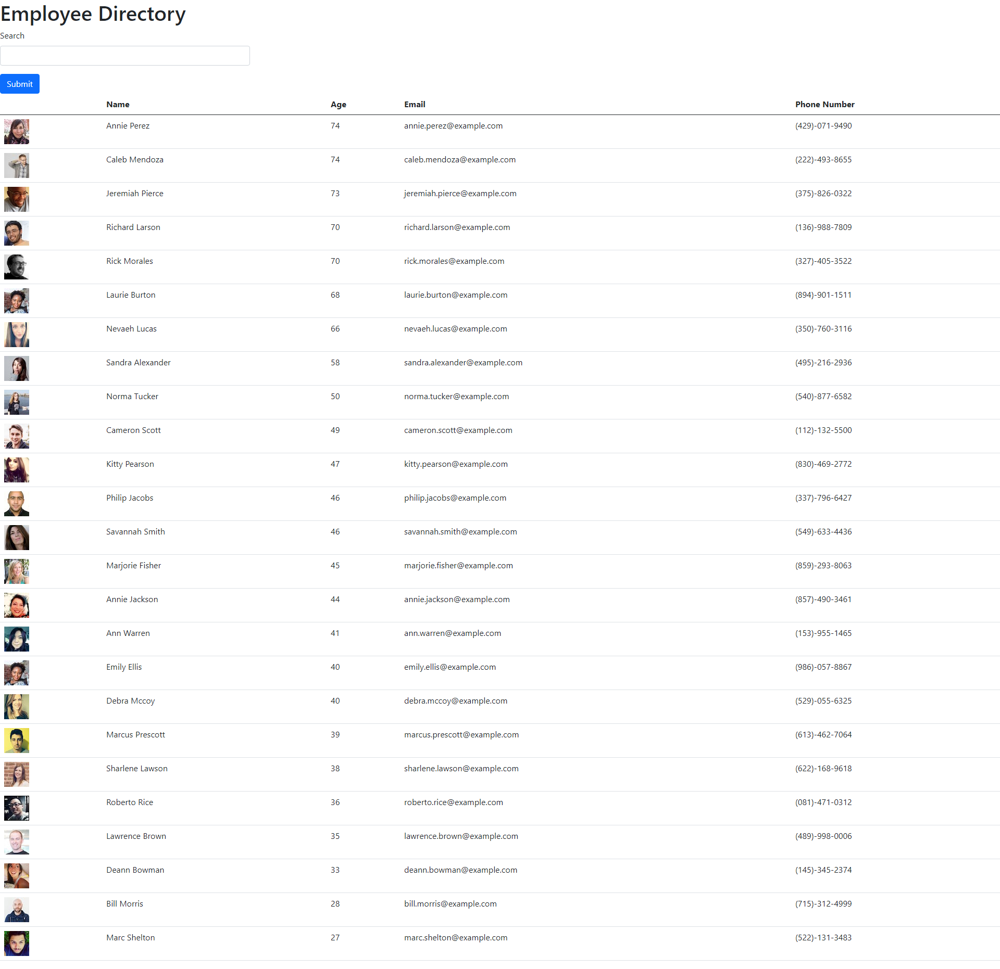

# Employee Directory - React

## Description

The goal of this project was to create an employee directory using the React library.  The app pulls data from the Random User API and displays the information in a table.  This project highlights React's capabilities to quickly and seamlessly render changing information on the screen.

## Installation

All functionality of this project contained within the deployed webpage itself.  Users can navigate to the following address to experience the application:
https://pkeld148.github.io/employee-directory-react-2/

## Usage

When the page loads, the user will be presented with a table of employees (placeholder data pulled from the Random User API).  Refreshing the page will load a new set of employee data.  The user can also click on the "Age" column header to sort according to age.  One of the project's objectives was to include a way to filter the employees' information with a search function, however I was unable to get that aspect working, and it has been left out for now.

## Credits

The Georgia Tech Boot Camp provided the majority of the information needed to complete this project.

## License

MIT License

Copyright (c) 2021 Paul Keldsen

Permission is hereby granted, free of charge, to any person obtaining a copy
of this software and associated documentation files (the "Software"), to deal
in the Software without restriction, including without limitation the rights
to use, copy, modify, merge, publish, distribute, sublicense, and/or sell
copies of the Software, and to permit persons to whom the Software is
furnished to do so, subject to the following conditions:

The above copyright notice and this permission notice shall be included in all
copies or substantial portions of the Software.

THE SOFTWARE IS PROVIDED "AS IS", WITHOUT WARRANTY OF ANY KIND, EXPRESS OR
IMPLIED, INCLUDING BUT NOT LIMITED TO THE WARRANTIES OF MERCHANTABILITY,
FITNESS FOR A PARTICULAR PURPOSE AND NONINFRINGEMENT. IN NO EVENT SHALL THE
AUTHORS OR COPYRIGHT HOLDERS BE LIABLE FOR ANY CLAIM, DAMAGES OR OTHER
LIABILITY, WHETHER IN AN ACTION OF CONTRACT, TORT OR OTHERWISE, ARISING FROM,
OUT OF OR IN CONNECTION WITH THE SOFTWARE OR THE USE OR OTHER DEALINGS IN THE
SOFTWARE.